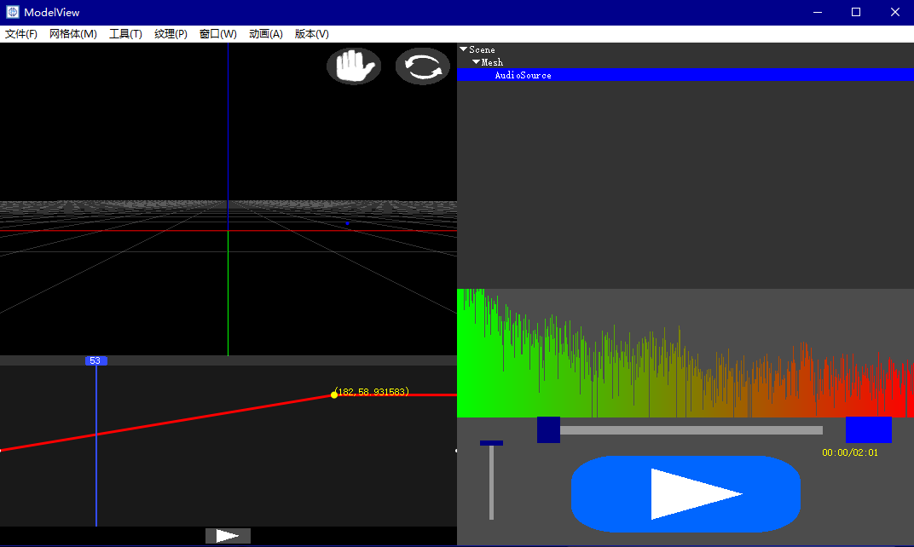
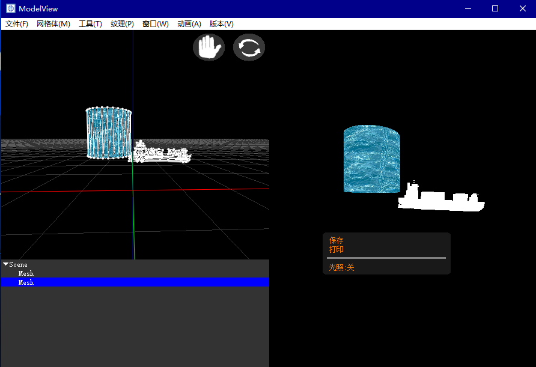
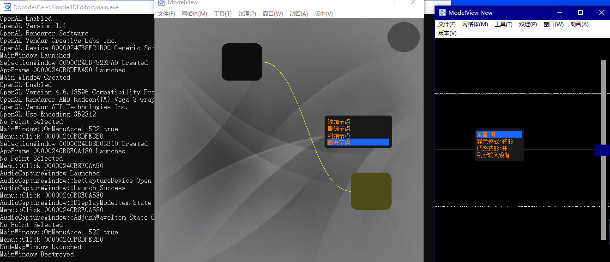
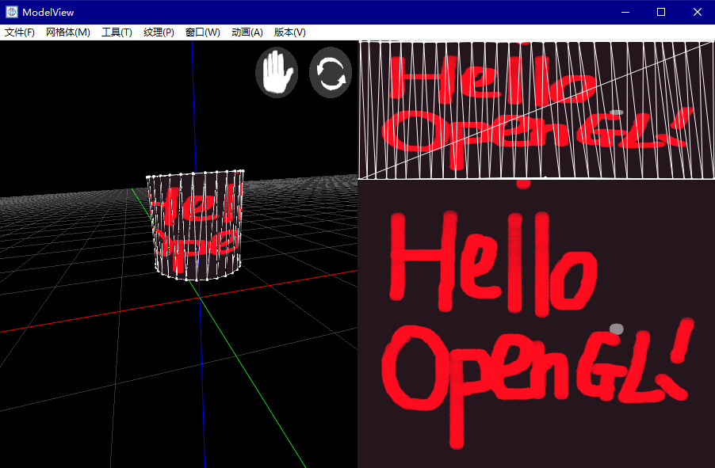

# Simple3DEditor

## 介绍

一个有基础功能的3D编辑器，使用C++编写，图形基于OpenGL
但可能经过这一段时间以来的修订，不再仅仅只有基础功能

此仓库分支为多媒体加强版，目前主要维护的分支(虽然编译成主程序也只是差不多1MB大小)

### 加入的库

1. OpenGL
2. OpenAL
3. stb_image
4. SoundTouch
5. FFmpeg

### 软件功能

1. 基础建模
2. 基础绘图
3. UV坐标编辑以及贴图
4. 音频解码
5. 变声器
6. 立体音频
7. 渲染输出打印
8. 动画制作

### 待加功能

1. 材质
2. 音频编码输出
3. 视频编解码
4. 着色器编辑器
5. 渲染3D音频、动画、视频并编码输出
6. 代码控制节点编辑器
7. 着色器节点图编辑器
8. 3D画刷
9. 水彩仿真画刷
10. 光线追踪渲染
11. 插件系统，期望能注册窗口、菜单、对象、动画函数、修改器，操作对象，文件输入输出工具，
    甚至游戏编译器等
12. 内置小型MC游戏窗口(有点开玩笑的意思)

同时为了编译使用方便，将所有依赖(C++基础库及其操作系统平台库除外)都加入了此仓库，
确保编译时找依赖的烦恼更少一些

此项目目前就是我对从高中开始OI快三年经历的留念，感觉不做个软件出来对不起这三年时光，很可能一直维护到大学及以后

## 软件架构

### 编辑器

主要窗口:

1. MainWindow 主窗口
2. PaintWindow 绘画窗口
3. UVEditWindow UV坐标编辑器
4. TreeWindow 树状对象管理窗口
5. AudioPlayerWindow 音频播放器
6. AudioCaptureWindow 录音以及变声器
7. AnimationWindow 动画控制窗口
8. RenderWindow 渲染窗口
9. NodeMapWindow 节点编辑器(尚未完成)

GUI容器、管理器、组件等:

1. AnimationCurve 动画曲线
2. Container 容器
3. Menu 菜单
4. UIManager UI管理器
5. ViewManager 视口管理器

外部对话框:

1. ColorBoard 颜色选择框
2. Tips 提示信息

### 工具库

#### 注:部分功能平台相关，源代码位于platform目录下

基本:

1. String 字符串(平台相关)
2. List 可变数组
3. File 文件(平台相关)
4. Queue 队列
5. StringBuilder 字符串构建类
6. AudioUtils 音频工具
7. DataBuffer 数据缓冲

图形库(如果有能力可以做其他图形API实现，甚至可以软光栅):

1. GLUtils 图形工具
2. GLSimplified 简化OpenGL函数
3. GLTexture2D 2D纹理
4. GLLights 光照管理
5. GLShader 着色器
6. GLProgram 着色程序
7. GLRenderTexture2D 2D可渲染纹理
8. GLVertexArray 顶点数组
9. GLVertexBuffer 顶点缓冲
10. GLIndexBuffer 索引缓冲
11. GLComputeProgram GPU计算程序

数学库:

1. Math 基本数学函数
2. LinearAlgebra 线性代数
3. Geometry 几何图形
4. Mesh 网格体
5. Property 属性
6. ViewObject 可见对象

操作系统库(期望跨平台的实现):

1. AppFrame 应用主窗口
2. Font 字体管理
3. GLFunc OpenGL扩展函数
4. Log 日志输出
5. Resource 资源管理
6. Shell 命令调用
7. Thread 线程管理
8. Time 时间

预想中待实现的部分:

1. GUIManager 2D对象管理，代替UIManager管理GUI组件，重要的是实现坐标变换的管理，这样也许还能实现3DGUI
    (其实如果使用AViewObject，继承产生一个CanvasObject也许也可以)
2. PluginManager 插件管理器，目前已经实现将主程序部分变为动态链接库，插件应通过符号依赖主程序函数与类进行操作
    (另外一个思路是使用Java语言对接)
3. WindowManager 窗口管理器，为了能在运行时注册更多类型的窗口
4. test文件夹里面或许可以用来放一堆单元测试代码
    (具体测试流程Makefile里面管理)
5. 集成AutoDesk的FBX SDK，导入导出.fbx格式的场景和对象
    (我还有一个2020.0.1版本的在电脑上)
6. 渲染管线还是自定义的好，就是花时间
7. 计算管线渲染光线追踪
    (实现起来很有难度，也不知道怎么拿到OpenRL SDK)
8. UI组件还缺少很多，以前我所写组件UIEditA因为UIManager的缺陷，完全达不到我期望的功能，
    现在要大改，我觉得至少应该有个属性编辑框
9. 集成json-cpp，方便程序或是插件保存一些简单配置
10. 让所有需要保存信息的类继承序列化接口并实现，实现保存程序状态的功能
    大致所想结构[魔法字'SVFILE', 对象标识符{数据, [对象标识符{...}, ...]}]，
    为单个根节点的多叉树结构，由主类发起序列化并多层遍历调用内部类
11. 每次命令后实现对应的IUndo并加入LocalData的队列以实现撤销功能，就是实现真的很多很麻烦
12. 用FreeType实现中文绘制并跨平台
13. 用GLFW实现跨平台应用窗口
    (windows平台为了某些功能，独立出来写在platform目录下也行，比如WM_DROPFILES消息监听等)
14. 换用GLEW获取OpenGL扩展函数
    (我手动导入完全是因为没配置好)
15. 如果可以的话，将插件IDE集成进来，让插件编写运行方便
    (会不会变得像Houdini一样啊?)
16. 如果选用Java作为插件语言，那也许可以带上一个运行时，将一堆插件集成为一个独立的程序
    (但说起来unity3d在Android平台上的做法是不是就是如此...)
17. Epic Games的ShaderConductor是开源的，也许可以用于实现跨图形API的着色器
18. "渲染功能"应该可以加入动画过程中的3D音频，想办法实现获取OpenAL的双声道输出，
    并借助FFmpeg直接渲染输出有声视频
    (这也是我相当想实现的功能)
19. OpenAL播放时若当前设备拔出会无法再次播放声音，应写出一个平台相关的硬件更改事件，
    并在此事件过程中刷新所有音频数据，可以让所有音频播放由AViewObject的派生类实现，
    并且在事件中遍历场景所有音源类型的对象通知刷新，注意在音源对象中保存音频数据

设想终于写完了，也不知道几年能肝完。。。
最近打算好好学习，我自己就不敲那么多代码了，求好心人帮忙实现一下(我觉得想多了，毕竟这怕都算是大工程了)

## 软件截图

## 安装教程

1. 直接下载release或者下载源代码编译
2. 确保mingw工具已经安装并配置路径（全依赖代码分支为AVDevelop）
3. 下载文件夹路径下执行make.exe

## 使用说明

1. 文档暂且没时间写，更多快捷键可以看.rc文件
2. 可能出现一些bug
3. 截止目前实际上贡献者就我一个人，若求更新也请体谅作者的肝

## 快捷键一览表

### 特别注意:Ctrl+W打开窗口控制菜单

1. "p"：添加点
2. "f"：添加线、面（选择两个或三个点）
3. "g"：移动
4. "r"：旋转
5. "s"：缩放
6. "c"：选择颜色（先选择顶点）
7. "x"：X轴操作
8. "y"：Y轴操作
9. "z"：Z轴操作
10. "X"(shift + x)：YZ平面操作
11. "Y"(shift + y)：ZX平面操作
12. "Z"(shift + z)：XY平面操作
13. delete：删除顶点
14. ESC：退出
15. Ctrl+S：保存
16. Alt+/ Alt+?：软件信息
17. Alt+(0-9): 工具选择
18. Ctrl+L: 加载
19. "e": 引出新顶点
20. Shift+A: 基本菜单
21. Ctrl+P: 打印

## 参与贡献

1. Fork 本仓库
2. 新建 Feat_xxx 分支
3. 提交代码
4. 新建 Pull Request

## 特技

1. 使用 Readme\_XXX.md 来支持不同的语言，例如 Readme\_en.md, Readme\_zh.md
2. Gitee 官方博客 [blog.gitee.com](https://blog.gitee.com)
3. 你可以 [https://gitee.com/explore](https://gitee.com/explore) 这个地址来了解 Gitee 上的优秀开源项目
4. [GVP](https://gitee.com/gvp) 全称是 Gitee 最有价值开源项目，是综合评定出的优秀开源项目
5. Gitee 官方提供的使用手册 [https://gitee.com/help](https://gitee.com/help)
6. Gitee 封面人物是一档用来展示 Gitee 会员风采的栏目 [https://gitee.com/gitee-stars/](https://gitee.com/gitee-stars/)
